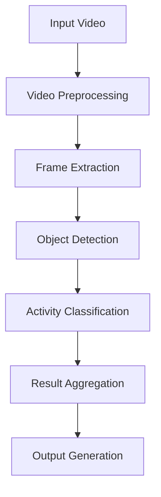
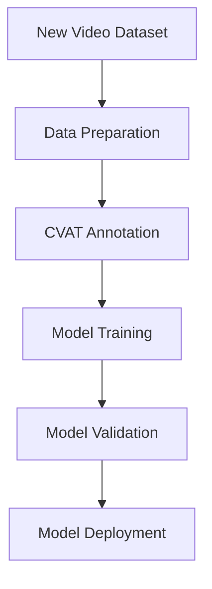

# Vision Trax Application Flow

This document outlines the process flow for the Vision Trax application, including both standard processing and model training workflows.

## Standard Processing Flow

### 1. Video Preprocessing
- Video format validation
- Resolution standardization
- Frame rate normalization
- Memory optimization

### 2. Frame Extraction
- Frame sampling based on requirements
- Frame quality assessment
- Frame storage optimization

### 3. Object Detection
- Person detection using YOLOv8
- Object detection (phones, computers, etc.)
- Confidence threshold filtering
- Bounding box generation

### 4. Activity Classification
- Pose estimation
- Activity state determination
- Temporal analysis
- Context awareness

### 5. Result Aggregation
- Time-based activity tracking
- Event correlation
- Statistical analysis
- Pattern recognition

### 6. Output Generation
- JSON/CSV data export
- Visualization generation
- Report creation
- API response formatting

## Model Training Flow

### 1. Data Preparation
- Video collection
- Frame extraction
- Dataset organization
- Data augmentation

### 2. CVAT Annotation
- Task creation in CVAT
- Label definition
- Video upload
- Manual annotation
- Quality verification

### 3. Model Training
- Base model selection
- Training configuration
- Training execution
- Checkpoint management

### 4. Model Validation
- Test dataset evaluation
- Performance metrics calculation
- Error analysis
- Model comparison

### 5. Model Deployment
- Model conversion
- Performance optimization
- Integration testing
- Production deployment

## Decision Points

### When to Train a New Model
1. **Accuracy Threshold**
   - Current model accuracy < 85%
   - High false positive rate
   - Missing critical detections

2. **New Use Cases**
   - New activity types
   - Different environments
   - New object types
   - Changed requirements

3. **Performance Issues**
   - Slow processing speed
   - High resource usage
   - Memory constraints

### Training Requirements

1. **Data Requirements**
   - Minimum 1000 annotated frames
   - Diverse scenarios
   - Various lighting conditions
   - Different angles

2. **Hardware Requirements**
   - GPU with 8GB+ VRAM
   - 16GB+ RAM
   - Sufficient storage for datasets

3. **Time Estimates**
   - Data preparation: 2-4 hours
   - Annotation: 4-8 hours
   - Training: 2-4 hours
   - Validation: 1-2 hours

## Integration Points

### CVAT Integration
- Task creation
- Data upload
- Annotation export
- Model training data preparation

### Model Management
- Version control
- Performance tracking
- Deployment management
- Rollback procedures

### Output Integration
- API endpoints
- Data storage
- Visualization tools
- Reporting systems

## Best Practices

1. **Data Management**
   - Regular dataset updates
   - Quality control
   - Version tracking
   - Backup procedures

2. **Model Management**
   - Regular performance monitoring
   - Incremental training
   - A/B testing
   - Version control

3. **Process Optimization**
   - Automated testing
   - Continuous integration
   - Performance monitoring
   - Resource optimization 