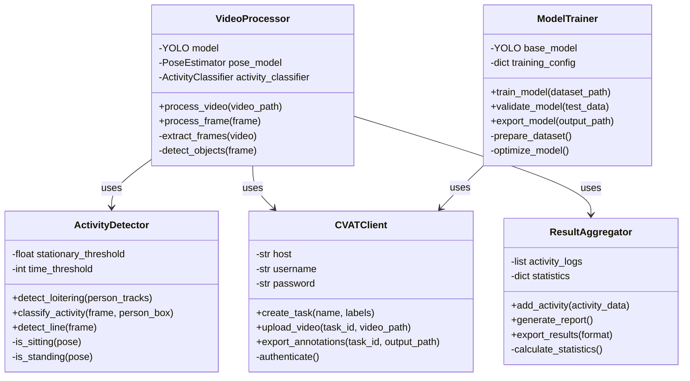
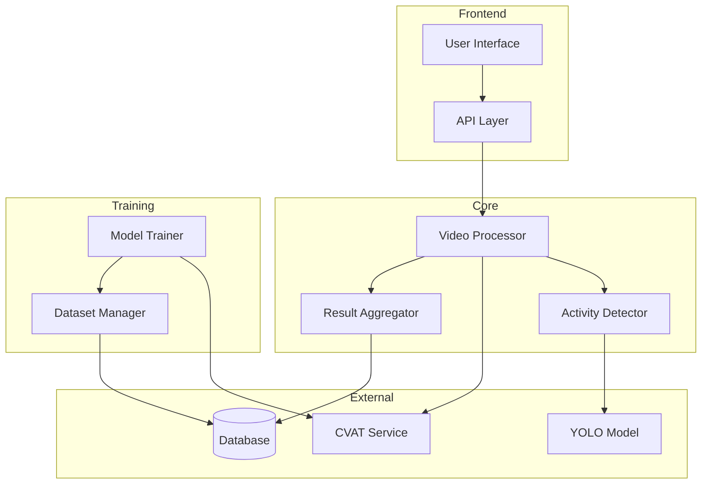
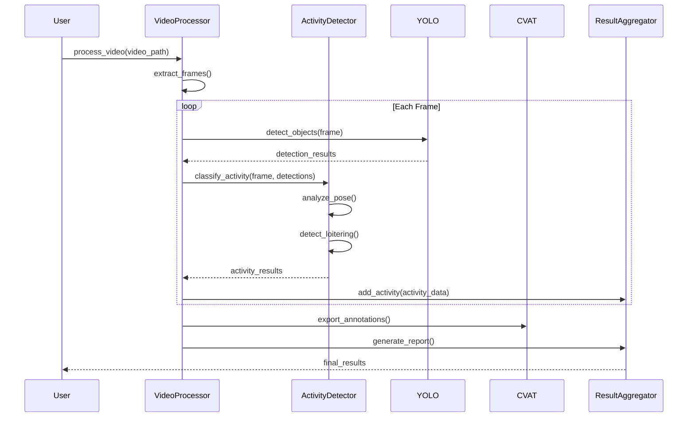
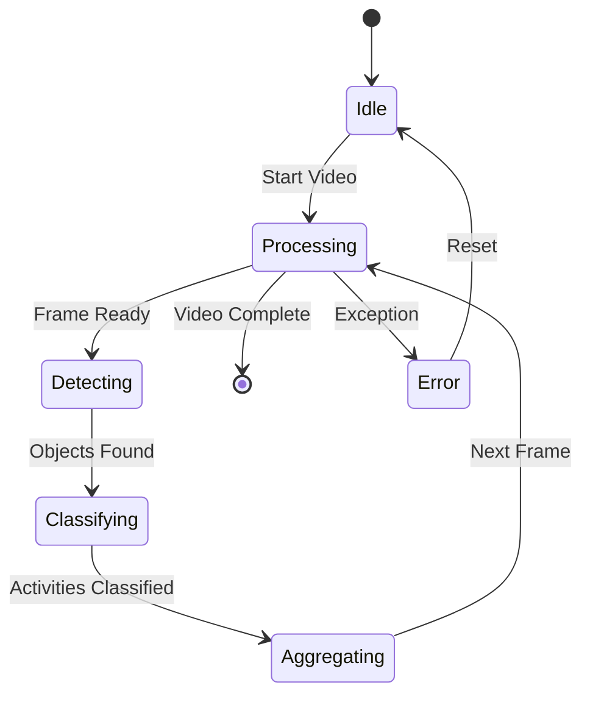

# Vision Trax Software Architecture

This document outlines the software architecture of Vision Trax using UML diagrams to illustrate the key components and their relationships.

## Class Diagram

## Component Diagram

## Sequence Diagram

## State Diagram

## Key Components Description

### 1. VideoProcessor
- Main orchestrator of the video processing pipeline
- Manages frame extraction and processing
- Coordinates between different components

### 2. ActivityDetector
- Handles activity classification
- Manages loitering detection
- Processes pose estimation

### 3. CVATClient
- Manages communication with CVAT service
- Handles video upload and annotation export
- Manages authentication and session

### 4. ModelTrainer
- Handles model training and optimization
- Manages dataset preparation
- Controls model validation and export

### 5. ResultAggregator
- Collects and processes activity data
- Generates reports and statistics
- Manages data export

## Data Flow

1. **Input Processing**
   - Video file ingestion
   - Frame extraction
   - Preprocessing

2. **Detection Pipeline**
   - Object detection
   - Activity classification
   - Pose estimation

3. **Result Processing**
   - Data aggregation
   - Statistical analysis
   - Report generation

4. **Output Generation**
   - JSON/CSV export
   - Visualization
   - API responses

## Integration Points

### External Services
- CVAT for annotation
- YOLO for object detection
- Database for storage

### Internal Components
- Activity detection
- Result aggregation
- Model training

## Error Handling

1. **Video Processing**
   - Format validation
   - Frame extraction errors
   - Processing timeouts

2. **Model Operations**
   - Training failures
   - Inference errors
   - Resource constraints

3. **External Services**
   - API timeouts
   - Authentication failures
   - Network issues 